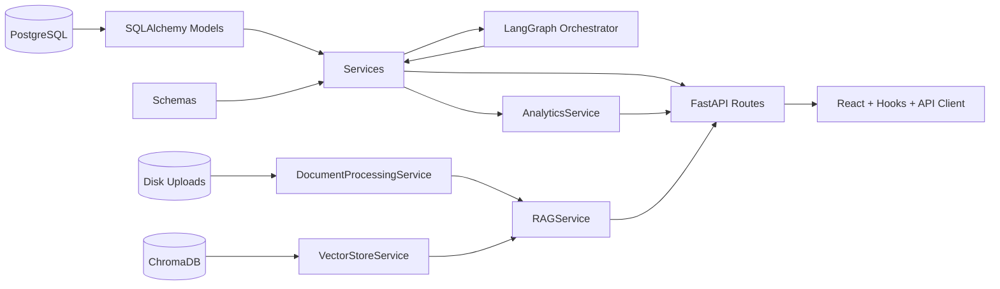
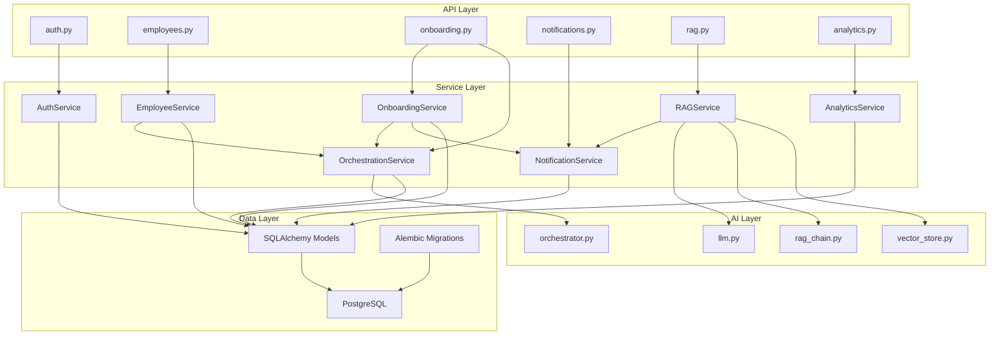

# DEPENDENCIES

## Primary Dependency Flow
Database -> Models -> Schemas -> Services -> LangGraph -> API Routes -> Frontend -> Analytics

## Layer Dependency Details
1. Database
- PostgreSQL tables managed by Alembic
- Chroma collections for semantic chunks
- Disk storage for uploaded docs

2. Models
- SQLAlchemy entities map database tables

3. Schemas
- Pydantic request/response validation around model-backed service I/O

4. Services
- Business logic, orchestration coordination, notification generation, analytics aggregation

5. LangGraph
- Invoked by OrchestrationService to derive tasks/state/events/escalations

6. API Routes
- Thin route handlers using dependency injection and service calls

7. Frontend
- API client + hooks + pages consume route contracts

8. Analytics
- Aggregation service consumes model data and powers dashboard views

## Mermaid: End-to-End Dependency

## Mermaid: Backend Dependency Stack

